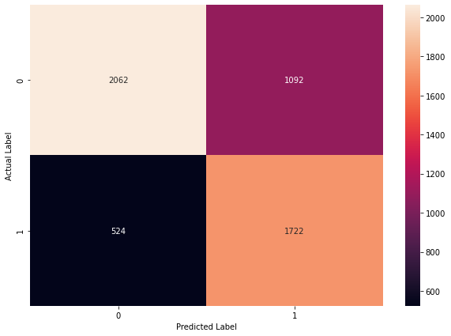
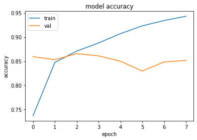
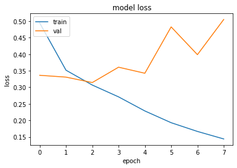
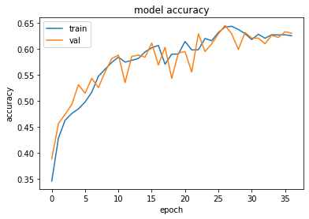
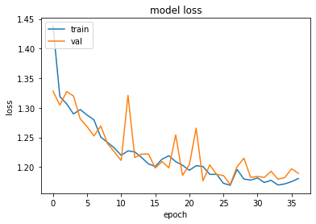

# Awesome AI: 2021

Artificial intelligence, sometimes called machine intelligence, is intelligence demonstrated by machines, unlike the natural intelligence displayed by humans and animals.

In the twenty-first century, AI techniques have experienced a resurgence following concurrent advances in computer power, large amounts of data, and theoretical understanding; and AI techniques have become an essential part of the technology industry, helping to solve many challenging problems in computer science, software engineering and operations research.

### Welcome to my GitHub repository

Here you will find some of my machine Learning based solution notebooks for Natural Language Processing & Understanding, Time Series, Computer Vision and everything in between.

---

## Codebase

### Analytics

#### Churn Detection

Churn quantifies the number of customers who have left the brand by cancelling their subscription or stop paying for services. This is bad news for any business as it costs five times as much to attract a new customer as it does to keep an existing one.

A high customer churn rate will hit any company’s finances hard. By leveraging advanced artificial intelligence techniques like machine learning (ML), one can anticipate potential churners.

- [Churn Prediction Through Usage Analysis](analytics/churn-prediction-through-usage-analysis.ipynb) - Of all users leaving, the model detected 76% (recall on test set) of them which is a good performance considering our objective is to detect leavers.

### Natural Language

#### Embeddings

In the context, embeddings are low-dimensional, learned continuous vector representations of discrete variables.
An embedding is a mapping of a discrete — categorical — variable to a vector of continuous numbers.
Word embedding is a term used for the representation of words for text analysis, typically in the form of a real-valued vector that encodes the meaning of the word such that the words that are closer in the vector space are expected to be similar in meaning

- [Word2Vec Embeddings - Skip Gram Model Using Negative Sampling](natural-language/skip-gram-word2vec.ipynb)
- [Training Embeddings From Scratch Or Use Pre-trained Embeddings](natural-language/embeddings-playground.ipynb)

#### Sentiment Classification

Sentiment classification is the automated process of identifying opinions in text and labeling them as positive, negative, or neutral, based on the emotions.

- [IMDb Moview Review Classification](natural-language/classification-playground.ipynb)

Custom `Layer` implementations:

- [GRU Encoder Implementation](natural-language/encoder.py)
- [Feed Forward Network Layer Implementation From Transformer Architecture](natural-language/feed_forward_network.py)

<!-- ### Time Series

A time series is a series of data points indexed (or listed or graphed) in time order.

- [Sales Forecasting](time-series/)

### Structured Data

Predictive analytics is the branch of the advanced analytics which is used to make predictions about unknown events using tabulated data points.

- [Customer Churn Prediction](structured-data/)
- [Customer Lifetime Value Prediction](structured-data/) -->

### Computer Vision

#### Image Classification

Image classification (a.k.a. image categorization) is the task of assigning a set of predefined categories/labels to a groups of pixels or an image.

- [Multi-class Flower Classification With Data Augmentation](computer-vision/image-classification-with-data-agumentation.ipynb)

`Model Architecture` implementations:

- [LeNet Model Architecture Implementation](computer-vision/le_net.py)
- [AlexNet Model Architecture Implementation](computer-vision/alex_net.py)

### TensorFlow 2 API

TensorFlow is a free and open-source software library for machine learning. It can be used across a range of tasks but has a particular focus on training and inference of deep neural networks. Tensorflow is a symbolic math library based on dataflow and differentiable programming.

- [Sequential API](tensorflow2-api/sequential-model-api.ipynb)
- [Functional API](tensorflow2-api/functional-model-api.ipynb)
- [Train and Evaluate Model](tensorflow2-api/train-and-evaluate-model.ipynb)
- [Model Run Customizations](tensorflow2-api/model-run-customizations.ipynb)
- [Writing Custom Layers and Models](tensorflow2-api/writing-new-layers-and-models-via-subclassing.ipynb)

