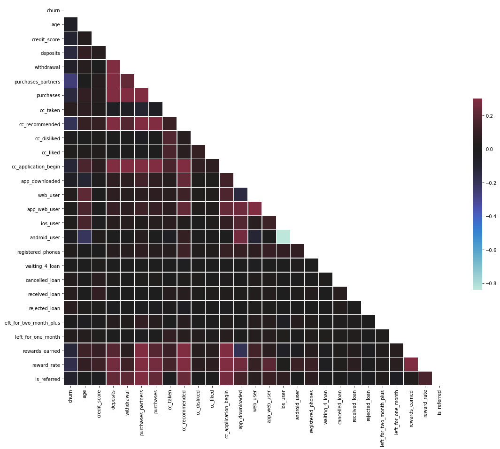

# Analytics

## Churn Detection

Churn quantifies the number of customers who have left the brand by cancelling their subscription or stop paying for services. This is bad news for any business as it costs five times as much to attract a new customer as it does to keep an existing one.

A high customer churn rate will hit any company’s finances hard. By leveraging advanced artificial intelligence techniques like machine learning (ML), one can anticipate potential churners.

- [Churn Prediction Through Usage Analysis](churn-prediction-through-usage-analysis.ipynb) - The bagging based ensemble model (Random Forest) was able to detect 77% (recall on test set) of the churners with an accuracy of above 70% on an imbalanced dataset using random over-sampling, which is a good performance considering our objective is to detect churners.

## Credit Card Fraud Detection

- [Credit Card Fraud Transaction Detection](credit-fraud-detection.ipynb) - The bagging based ensemble model (Random Forest) was able to identify 100% (recall on test) of the fraud transactions with only 9 instances of FPR (false positive rate) on a very highly imbalanced dataset (where only 0.172% transactions where fraudulent) using SMOTE and weighted objective function.

