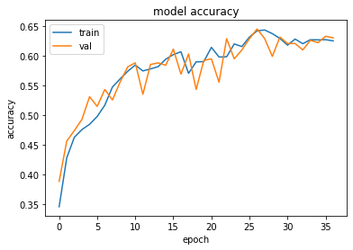

# Computer Vision

## Image Classification

Image classification (a.k.a. image categorization) is the task of assigning a set of predefined categories/labels to a groups of pixels or an image.

- [Multi-class Flower Classification With Data Augmentation](multi-class-image-classification-with-data-agumentation.ipynb)

`Model Architecture` implementations:

- [LeNet Model Architecture Implementation](le_net.py)
- [AlexNet Model Architecture Implementation](alex_net.py)
