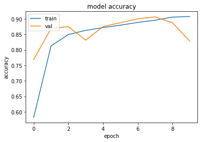
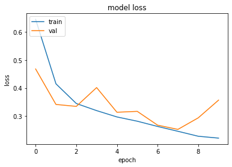

# Natural Language Processing

## Embeddings

In the context, embeddings are low-dimensional, learned continuous vector representations of discrete variables.
An embedding is a mapping of a discrete — categorical — variable to a vector of continuous numbers.
Word embedding is a term used for the representation of words for text analysis, typically in the form of a real-valued vector that encodes the meaning of the word such that the words that are closer in the vector space are expected to be similar in meaning

- [Word2Vec Embeddings - Skip Gram Model Using Negative Sampling](skip-gram-word2vec.ipynb)
- [Training Embeddings From Scratch Or Use Pre-trained Embeddings](embeddings-playground.ipynb)

## Text Classification

Text classification also known as text tagging or text categorization is the process of categorizing text into organized groups.

- [IMDb Moview Review Sentiment Classification](imdb-movie-review-classification.ipynb) - Implemented a stacked bi-directional LSTM architecture which learns embeddings from scratch and classifies movie reviews into positive and negative sentiments with an accuracy of over 85% on out of sample test dataset.

Custom `Layer` implementations:

- [GRU Encoder Implementation](encoder.py)
- [Feed Forward Network Layer Implementation From Transformer Architecture](feed_forward_network.py)
